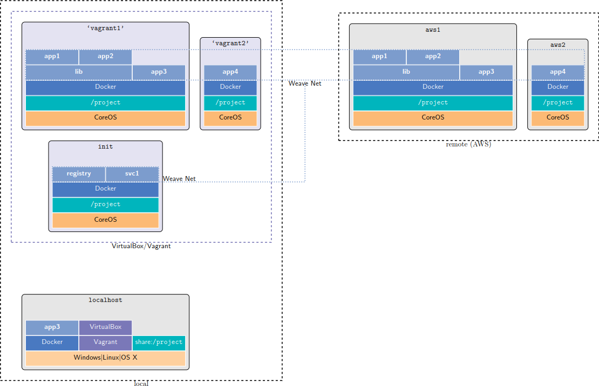

this is the btrfs branch with the following change/feature:
- the registry just can't use the winnfs share (win problem?)! so now it doesn't write to the local files. However, as a work around, the registry uses a mounted filesystem created on your shared file folder. The downside is the you have to set some size by setting `VARLIBDOCKER_GB` (GB in integers) in [config/project.env](config/project.env). it turns out that any program that needs advanced access to the filesystem, cannot use the nfs share. so i'm thinking of making this change as part of the master branch.


# CoreOS-based personal compute cloud
formal writeup in appendix A of [thesis](https://github.com/majidaldo/tsad-docs/raw/a172e2f9f50f01c0c4cdb6c68d3d315f874fb78a/thesis.pdf)

personal compute cloud using [Ansible](http://www.ansible.com), [CoreOS](http://www.coreos.com),  [Docker](http://www.docker.com), [Vagrant](http://www.vagrantup.com), [Virtualbox](https://www.virtualbox.org), and [weave](http://weave.works).

`git clone --recursive https://github.com/majidaldo/personal-compute-cloud.git`

## Why?
because scientific computing [(some explanation)](http://msdresearch.blogspot.com/2015/08/personal-compute-cloud-infrastructure.html). Briefly, the goal is cater to a workflow that starts with local development, and seamlesslessly brings more compute power on demand.

## What it Does
Two types of machines are started to support the scientific computing workflow (using Docker). There is a local virtualized controller machine (called init) prividing coordination and services; and compute machines that are more ephemeral. A local compute machine is brought up for 'development'. But when a remote compute machine is acquired, it would use the same (ansible) setup script. Therefore, the local compute machine is really a stand-in for a remote machine.



The controller and compute machines together provide:

## Features
- global network addressing of docker containers across clouds (thanks to weave)
- private docker registry accessible on all compute hosts (started on boot). The images in the registry persist over instantantiations of the machines as they are stored on the local file system.
- automatic building of Dockerfiles and pushing them to the registry (on boot)
- global NFS fileshare .. no messing with sending and receiving files (functioning but not properly but seems find for working with code)
- automatic configuration of ssh access
- CUDA installation (if machine has NVIDIA gpu)
- Saving of compute machine state in EC2 or Vagrant for quick resumption of work.


## Prerequisites

- Linux: duh. windows users can use  (plain) [`cygwin`](http://www.cygwin.com). but i prefer [`babun`](http://babun.github.io). 
- Ansible: tested with 1.9. works on windows with cygwin with [`setup/cygwin/install-myansible.sh`](setup/cygwin/install-myansible.sh). But as of 8/'15, you'll have to get my version of Ansible even on Linux until [this](https://github.com/ansible/ansible-modules-core/pull/1978) gets figured out.
- python-vagrant
- Vagrant: windows users should install vagrant-winnfsd (see [`setup/install-vagrant.bat`](setup/install-vagrant.bat)). Kill the winnfs.exe process if you have nfs mounting issues

## Setup

*Variables*

Project-level variables are located in `.env` files in the [`config/`](config/) folder. CoreOS-specific variables are in `config/coreos`. Ansible-specific variables are in their appropriate Ansible best practice location in [`ansible/`](ansible). There is no immediate need for changing these variables as I tried to make everything as automatic and reasonable as possible.

Exceptions: You may want to remove the line `control_path = /tmp` in [`ansible/ansible.cfg`](ansible/ansible.cfg) as it is a cygwin hack. Also,  NFS mount options can be overriden by specifiying `NFS_OPTS` in [`config/coreos/global.env`](config/coreos/global.env) if you are having trouble with NFS mounting (an attempt is made to automatically set them). On a related note, `NFS_SERVER` in [`config/coreos/init.env`](config/coreos/init.env) is hard-coded to correspond with `VAGRANT_INT_IP` in [`ansible/library/vagrant`](ansible/library/vagrant). Change as needed.

*Dockerfiles*

So all you have to do is add your Dockerfiles in the [`docker/`](docker/) folder like [`docker/999-mybusybox`](docker/999-mybusybox). The build script will only build folders that start with an number followed by a hyphen, in order. Make use of this behavior to satisfy Docker image dependencies.

*Initialization*

Run [`setup/setup.sh`](setup/setup.sh) from within its directory.

*Provider Inventory*

Also, in [`ansible/inventory/ansible`](ansible/inventory/ansible) remove the Ansible dynamic inventory scripts for unused providers. But don't remove [vagrant.sh`](ansible/inventory/ansible/vagrant.sh).


## Usage

`cd ansible`. Start the init machine: `ansible-playbook init.yml`. Now you can `ssh init`.

### Compute Provisioning

Then aquire the machines with the provided ansible playooks with any of the following providers.

#### Vagrant
Start machine: `ansible-playbook vagrant.yml`.

#### EC2 (suggested method)

Setup your EC2 account. Add the following substituting your credientials to `config/.private`
```
AWS_ACCESS_KEY_ID='mykeyid'
AWS_SECRET_ACCESS_KEY='mykey'
```
Start machine: `ansible-playbook ec2.yml`. To get a GPU machine: `ansible-playbook ec2.yml -e type=gpu`.

### Compute Machine Setup

After getting the machines, set them up: `ansible-playbook  setup.yml -e hosts=ansiblepattern`. [`ansiblepattern`](http://docs.ansible.com/ansible/intro_patterns.html) is usually going to be the provider name. You can also use any of the groups defined in [`ansible/inventory/ansible/hosts`](ansible/inventory/ansible/hosts).

After setup you can `ssh ec2hostname` or `ssh vagrant` because hosts are automatically added to `~/.ssh/config`. Furthermore, hosts are aliased with a prefix made of a group name followed by a hypen. So, `ssh cpu-vagrant` or `ssh ec2-someec2hostt` will work since there are groups for providers (eg. vagrant or EC2) and compute type (cpu or gpu). EC2 machines have more groups than the ones defined in the [hosts](ansible/inventory/ansible/hosts) file such as instance type and instance id. (Depending on your shell, you might be able to just hit tab after partially issuing the `ssh` command to complete the command.)

### Misc
- Shortcut local machine setup: [ansible/all-local.sh](ansible/all-local.sh). Sets up init machine and a (local) vagrant compute machine.
- `ansible/destroy-acomputeprovider.sh` to decommision its hosts.
- `$REGISTRY_HOST` is a variable on all machines to access the private docker registry like `docker pull $REGISTRY_HOST/mybusybox`. See note about setting up your dockerfiles in the Setup section.
- Use the build script `docker/build.sh` to iterate on your dockerfiles.
- Make use of `weave` commands.
- Make use of the file share on `/project`.
- `cd` into `ansible/.vagrant` to issue `vagrant` commands on the local machine.
- Use `cuda` [docker image](https://github.com/majidaldo/coreos-nvidia) to build your CUDA application.
- Clean out your old hosts by removing entries in the directory `~/.ssh/config.d/` and the `~/.ssh/config` file (just delete them if you're feeling brave. todo: automate this)
- Use `ansible/save-aprovider.sh` to save the state of its machines. Resume by running the corresponding provisioning and setup programs.


## Notes
- No claims are made as to the security (or lack there of) of this setup. Convenience (in the form of simplicity and automation) takes priority over security measures.
- fleet and etcd, part of CoreOS, have been disabled. I don't see a use for them for the intended workflow. 
- Given harware-assisted virtualization (enabled in virtualbox), perfomance should be close to bare-metal performance. Unfortunately, GPU passthrough (for the local compute machine) is not a simple matter (help!).
